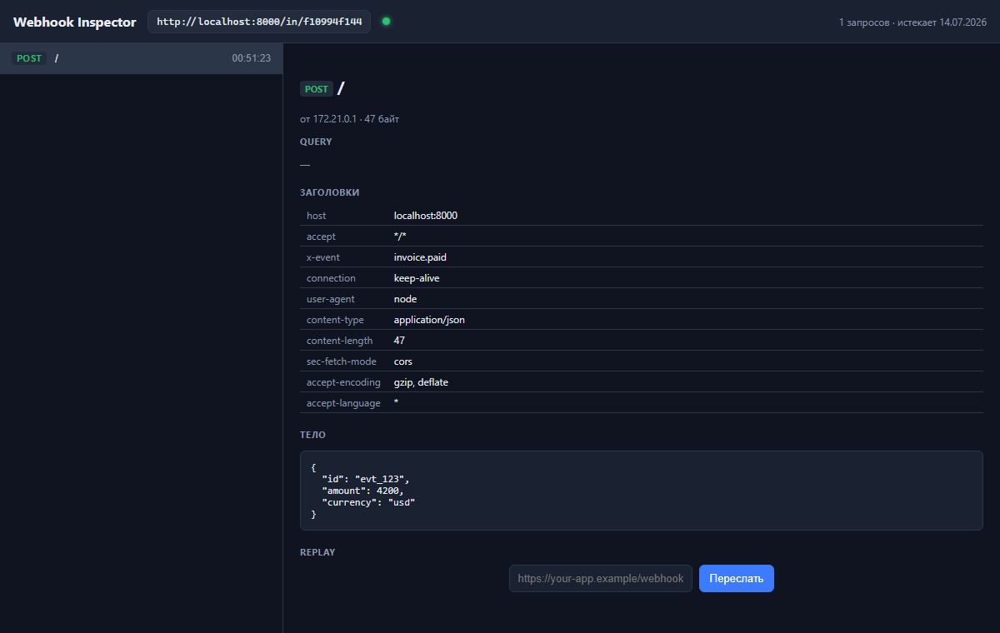
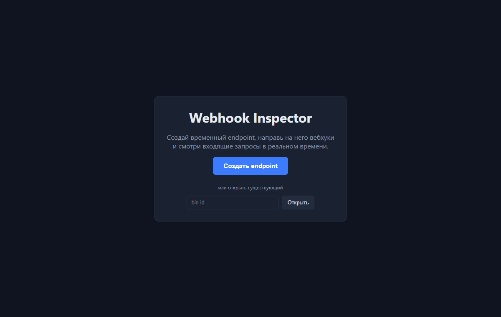
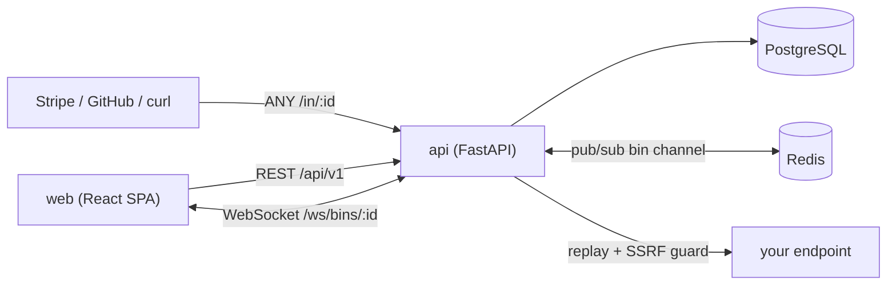

# Webhook Inspector

Инструмент для отладки вебхуков: создаёшь временный endpoint, получаешь публичный
URL, направляешь туда вебхуки (Stripe, GitHub, Telegram — что угодно) и видишь
входящие запросы **в реальном времени** — с методом, заголовками, телом и метаданными.
Любой захваченный запрос можно **переслать (replay)** на свой адрес.

Аналог webhook.site. Pet-проект, показывающий полный цикл: spec-first
([SPEC.md](SPEC.md)) → доменная модель → API → тесты → Docker → CI, с журналом
решений в [DECISIONS.md](DECISIONS.md).

## Возможности

- **Bin** — временный endpoint `/in/{binId}`, создаётся анонимно (знание id = доступ), живёт 7 дней (TTL).
- **Захват любым HTTP-методом**: метод, путь-суффикс, query, заголовки, тело (raw + pretty JSON), IP, размер, время.
- **Live-tail** новых запросов по **WebSocket** — без перезагрузки страницы.
- **Replay** — сервер повторяет захваченный запрос на указанный URL, **со SSRF-защитой**.
- Лимиты: размер тела (256 KB, с усечением), кольцевой буфер (500 запросов/bin), rate limiting.

## Скриншоты

Захваченный запрос с live-обновлением, деталями и replay:



Создание endpoint:



## Технологический стек

| Слой | Технологии |
|------|-----------|
| Бэкенд | Python 3.12, **FastAPI** (+ WebSocket), SQLAlchemy 2.0 async, Alembic, Pydantic v2 |
| Хранение / стриминг | PostgreSQL, **Redis** (pub/sub для live + rate limit) |
| Исходящие запросы | HTTPX (replay) |
| Фронтенд | React 18, TypeScript (strict), Vite, TanStack Query, нативный WebSocket |
| Инфраструктура | Docker, Docker Compose, nginx |
| Качество | pytest, ruff, ESLint, GitHub Actions |

> Код бэкенда следует официальному **FastAPI agent skill** (`Annotated`-зависимости,
> `response_model`, `fastapi run`) — см. [DECISIONS.md](DECISIONS.md) ADR-005.

## Архитектура



Захваченный запрос сохраняется в Postgres и публикуется в Redis-канал `bin:{id}`;
все инстансы api рассылают событие своим WebSocket-клиентам (работает при
масштабировании; без Redis — рассылка в пределах процесса).

## Безопасность — SSRF-защита replay

Replay заставляет сервер сделать исходящий запрос на пользовательский URL —
классический вектор SSRF. Защита ([`app/core/ssrf.py`](backend/app/core/ssrf.py)):
разрешены только http/https; хост резолвится в IP, и **блокируются приватные,
loopback, link-local адреса** (включая cloud-metadata `169.254.169.254`);
редиректы запрещены; таймаут и лимит ответа. Покрыто параметризованными тестами.

## Быстрый старт (Docker Compose)

```bash
cp .env.example .env
docker compose up --build
```

| Сервис | URL |
|--------|-----|
| Веб-интерфейс | http://localhost:5173 |
| API | http://localhost:8000 |
| Health | http://localhost:8000/health |

Открой веб-интерфейс, нажми «Создать endpoint», и отправь тестовый запрос:
```bash
curl -X POST http://localhost:8000/in/<binId> -H "Content-Type: application/json" -d '{"event":"test"}'
```
Запрос появится в списке **мгновенно** (WebSocket).

## Локальная разработка

**Бэкенд** (нужны Postgres + Redis, либо `DISABLE_REDIS=true` для in-process live):
```bash
cd backend
python -m venv .venv && source .venv/Scripts/activate
pip install ".[dev]"
alembic upgrade head
fastapi dev app/main.py
```
**Фронтенд:**
```bash
cd frontend
npm install && npm run dev
```

## Тесты и качество

```bash
cd backend && ruff check app tests && pytest -q     # SSRF, ingest, лимиты, live-hub
cd frontend && npm run lint && npm run build
```
Тесты идут на sqlite + fakeredis (внешние сервисы не нужны).

## Основные эндпоинты

| Метод | Путь | Описание |
|-------|------|----------|
| POST | `/api/v1/bins` | Создать bin → `{id, url, expires_at}` |
| GET | `/api/v1/bins/{id}/requests` | История захваченных запросов |
| GET | `/api/v1/bins/{id}/requests/{rid}` | Детали запроса |
| POST | `/api/v1/bins/{id}/requests/{rid}/replay` | Переслать запрос (SSRF-guard) |
| ANY | `/in/{id}` и `/in/{id}/{path}` | Захват вебхука |
| WS | `/ws/bins/{id}` | Live-стрим новых запросов |
| GET | `/health` | Liveness (БД + Redis) |

Интерактивная документация — `http://localhost:8000/docs` (Swagger, встроен в FastAPI).

## Структура

```
webhook-inspector/
├── backend/  app/{api,core,db,models,schemas,services}/ + alembic/ + tests/
├── frontend/ src/{api,components,hooks,pages}/
├── docker-compose.yml   # api, db, redis, web
├── .github/workflows/ci.yml
├── SPEC.md / DECISIONS.md
```
